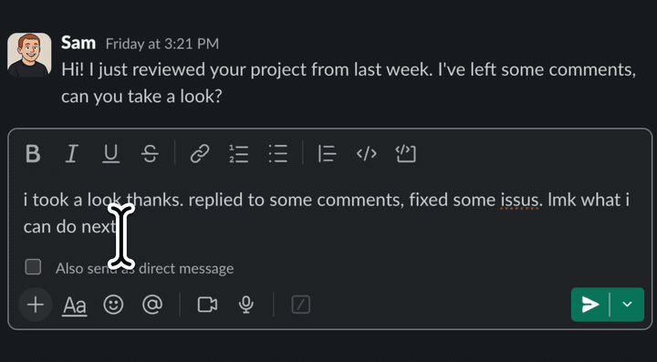

<div align="center">


# QuickEdit

**Rewrite, fix, or transform selected text in any macOS app — in place.**

Select text anywhere, hit a shortcut (or click the hint), describe the change, and QuickEdit applies it right where the text lives. No copy‑paste, no switching windows.

[](https://github.com/synth-inc/quickedit/releases/latest/download/QuickEdit.dmg)
[](https://github.com/synth-inc/quickedit/releases/latest)
[](LICENSE.md)


<br>



</div>

---

## What it does

Highlight text in any application and QuickEdit can:

- **Improve** it in one click — fix grammar, tighten wording, polish tone.
- **Edit** it with a custom instruction — "make this more formal", "translate to French", "turn this into bullet points", whatever you type.
- Apply the result **in place**, replacing your selection directly. The text never leaves the app you're working in.

A small hint appears next to your selection with **Improve** and **Edit** actions, or you can trigger it entirely from the keyboard.

## Install

Download the latest signed & notarized build and drag it to Applications:

➡️ **[QuickEdit.dmg](https://github.com/synth-inc/quickedit/releases/latest/download/QuickEdit.dmg)** (always the latest release)

Or browse all releases on the [Releases page](https://github.com/synth-inc/quickedit/releases). The app updates itself automatically via [Sparkle](https://sparkle-project.org).

> **Requirements:** macOS (Apple Silicon).

## Usage

| Action | Default shortcut | What it does |
|--------|------------------|--------------|
| **Improve** | `⌘ ⇧ I` | One‑click improvement of the selected text |
| **Edit**    | `⌘ ⇧ K` | Opens a prompt to describe the change you want |

You can also just **select text** and click the hint that pops up. Shortcuts are customizable in **Settings → Shortcuts**.

QuickEdit works with remote AI models (OpenAI, Anthropic, xAI, Google) and you can bring your own API key in **Settings**.

## Permissions

QuickEdit asks for macOS permissions only for what it needs (see [`PERMISSIONS.md`](macos/OnitQuickEdit/PERMISSIONS.md)):

| Permission | Why | Required? |
|------------|-----|-----------|
| **Accessibility** | Read the selected text, insert the edit, position the hint | **Required** |
| **Screen Recording** | Screenshot‑based selection detection for apps that don't expose text via Accessibility (e.g. Terminal) | Optional — only for the experimental non‑accessibility trigger |

Grant them under **System Settings → Privacy & Security**.

## Building from source

QuickEdit is a native macOS app (Swift / SwiftUI).

```bash
git clone https://github.com/synth-inc/quickedit.git
cd quickedit
```

1. **Add secrets.** API keys live in `macos/OnitQuickEdit/Secrets.xcconfig` (not tracked in git). Copy it in from your source, or start from `Secrets.xcconfig.sample` if present.
2. **Open** `macos/OnitQuickEdit.xcodeproj` in Xcode.
3. **Select** the `OnitQuickEdit` scheme and run (⌘R).

For a signed local build from the command line:

```bash
cd macos
./dev_build.sh            # build + re-sign with Developer ID
./dev_build.sh --install  # …and install to /Applications
```

## Project structure

```
macos/
├── OnitQuickEdit.xcodeproj        # Xcode project (scheme: OnitQuickEdit)
├── OnitQuickEdit/                 # App sources (Swift/SwiftUI)
│   ├── QuickEdit/                 # Core feature: triggers, flow, hint UI
│   ├── Onboarding/                # First-run onboarding
│   ├── Settings/                  # Settings UI
│   ├── KeyboardShortcuts/         # Global shortcuts
│   ├── Accessibility/ · ScreenRecording/   # Permission managers
│   └── Assets.xcassets/           # App icon, glyphs, colors
├── OnitTests/                     # Unit tests
├── dev_build.sh                   # Local build + Developer ID re-sign
├── build_and_notarize.sh          # Release build, sign, notarize, DMG
└── release.sh                     # Cut a Sparkle release (DMG + appcast)
```

## Releasing

Maintainers: see [`RELEASE.md`](RELEASE.md). In short — bump the version, then:

```bash
cd macos && ./release.sh <version>
```

This builds, notarizes, publishes a GitHub Release (with a stable `QuickEdit.dmg` permalink asset), and generates the EdDSA‑signed `appcast.xml` that powers auto‑updates.

## License

[Creative Commons Attribution‑NonCommercial 4.0 (CC BY‑NC 4.0)](LICENSE.md).

---

<div align="center">
Made by <a href="https://www.getonit.ai">Synthetic Exploration, Inc.</a>
</div>
